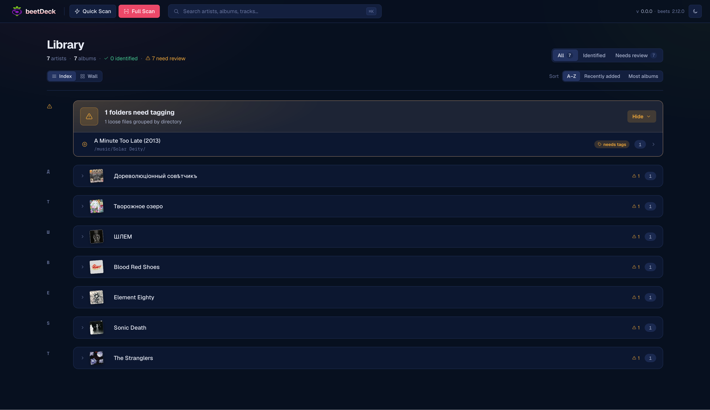
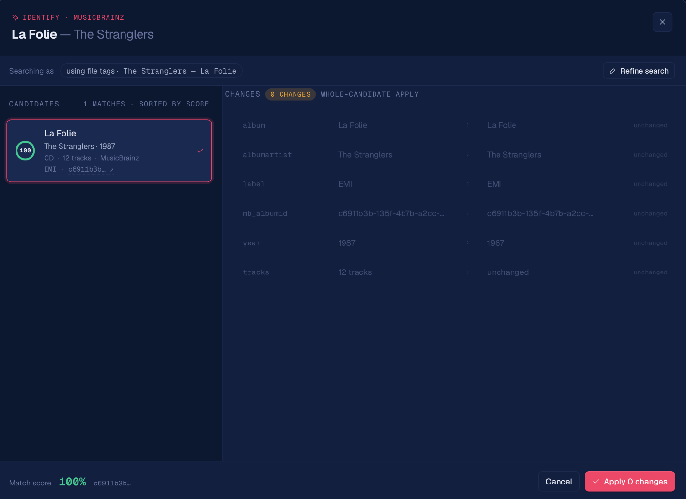
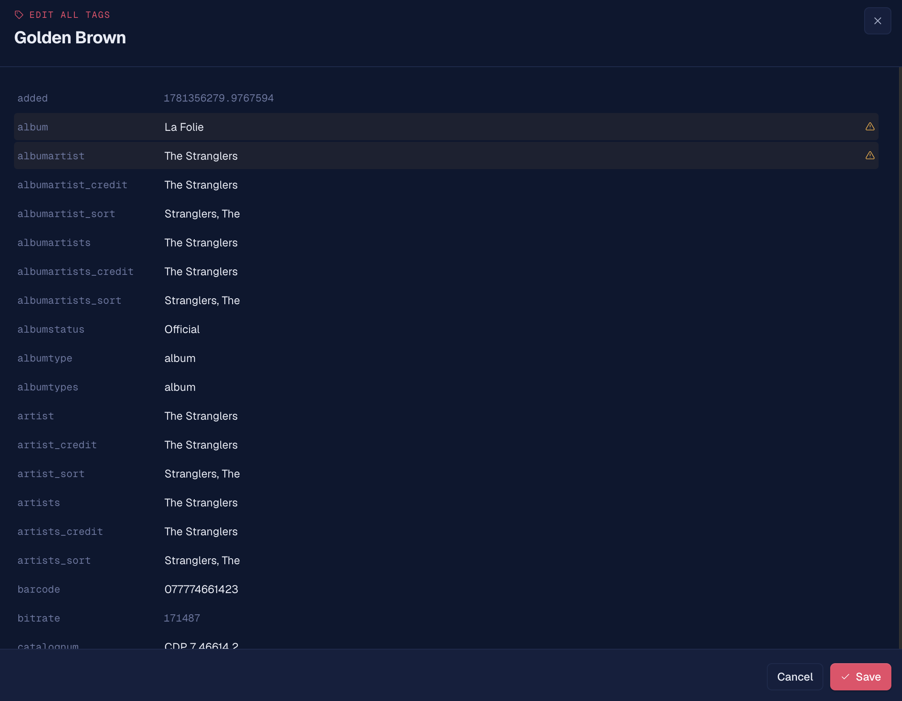
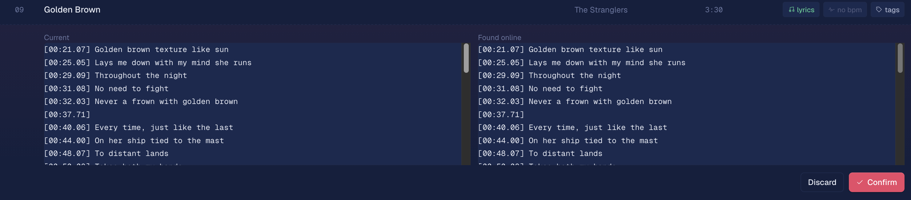
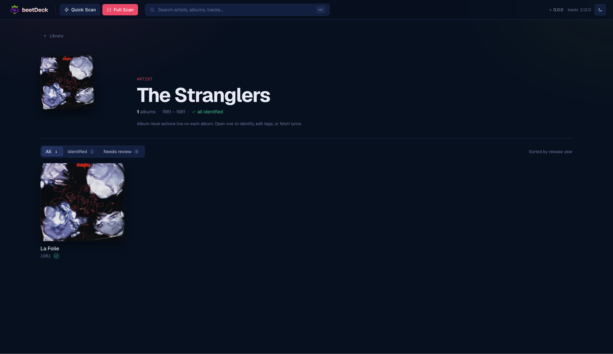

# beetDeck


**A web UI for tagging and organizing your [beets](https://beets.io/) music library.**

beetDeck gives your existing music collection a clean browser-based interface for
the tedious part of a library: getting the metadata right. It identifies albums
against MusicBrainz, fetches genres, cover art, and lyrics, lets you edit tags by
hand, and writes everything back into your audio files — no command line needed.

beetDeck is **not** a downloader or an importer. It doesn't fetch music or move
files around. Point it at a folder of audio you already have (managed by hand, or
by something like Lidarr) and it becomes the tagging and browsing layer on top.



## What you can do with it

- **Browse your library** — artists collapse into a tidy index, or switch to a
  cover-art wall. Each album shows its year and whether it's been identified yet.
- **Open an artist** — a dedicated page with every album for that artist in a grid.
- **Inspect an album** — cover art, full metadata, the file path on disk, and the
  complete track list with per-track actions. Multi-disc albums show each disc
  separately.
- **Identify albums** — match against MusicBrainz, compare candidates, preview
  exactly what will change, then confirm to write the tags into your files.
- **Fetch genres** — look up genres from Last.fm with an old-vs-new preview.
- **Get cover art** — pull artwork from the Cover Art Archive, iTunes, Amazon, or
  the local files; preview and confirm, or upload your own image. Saved as both a
  high-res file and an embedded thumbnail.
- **Manage lyrics** — synced or plain-text lyrics per track or for a whole album
  via lrclib, with an inline editor, online search, and a side-by-side diff before
  you save.
- **Edit tags by hand** — an *Edit tags* modal for album-level and per-track
  fields; album-level changes propagate to every track file.
- **Triage untagged files** — loose files with no album artist are grouped by
  folder and surfaced in a banner at the top of the library, with a bulk editor and
  a hand-off into MusicBrainz identification.
- **Search everything** — full-text search across artists, albums, and tracks,
  with full Unicode support.
- **Rescan** — a quick incremental scan or a full rescan to pick up new files and
  drop stale entries.
- **Light or dark theme** — follows your system preference, with a manual toggle.

### Identify against MusicBrainz

Pick the best candidate, review the diff, and apply only the changes you want.



### Edit tags directly

Every tag on the album and its tracks, editable in one place.



### Fetch and diff lyrics

Compare your current lyrics against what's found online before saving.



### One page per artist



## Running it

beetDeck ships as a single Docker image. You need [Docker](https://docs.docker.com/get-docker/)
with Compose, and a folder of music.

```bash
cp .env.example .env                       # set the host port and your paths
mkdir -p config music                      # config/ holds your beets config.yaml
cp config.yaml.example config/config.yaml  # edit if you want; the default works
docker compose up -d
```

Then open **http://localhost:8080** (or whatever `BEETDECK_HTTP_PORT` you set) and
run **Full Scan** in the top bar to load your library into beetDeck.

> **Your music folder must be writable.** beetDeck writes tags, cover art, and
> lyrics back into your audio files — that's the whole point.

### Configuration (`.env`)

| Variable              | Default                 | What it does                          |
|-----------------------|-------------------------|---------------------------------------|
| `BEETDECK_IMAGE`      | `semsemyonoff/beetdeck` | Image to run                          |
| `BEETDECK_TAG`        | `latest`                | Image tag — pin to a version in prod  |
| `BEETDECK_HTTP_PORT`  | `8080`                  | Port the UI is served on              |
| `BEETDECK_CONFIG_DIR` | `./config`              | Your beets config dir (holds `config.yaml`) |
| `BEETDECK_MUSIC_DIR`  | `./music`               | Your music library / import folder    |
| `TZ`                  | `UTC`                   | Timezone for logs and timestamps      |

Your beets database and app state persist in a Docker volume, so your work
survives restarts and upgrades.

### Handy commands

A `Makefile` wraps the common operations:

```bash
make up      # start the stack (reads .env)
make down    # stop it
make logs    # tail the logs
make ps      # container status
make pull    # pull a newer image tag
```

### Upgrading

Bump `BEETDECK_TAG` in `.env`, then:

```bash
make pull && make up
```

## About this repository

This repo is the deployment layer — the `docker-compose.yml`, `.env.example`, and
`config.yaml.example` you need to self-host. The application source lives in
separate repositories and is bundled into the published image; you don't need it to
run beetDeck.
